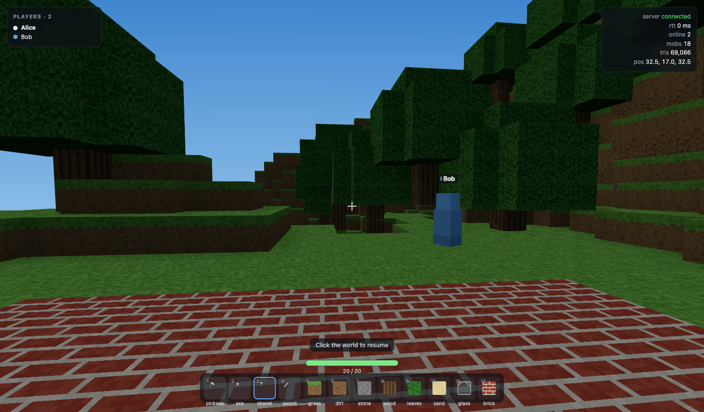
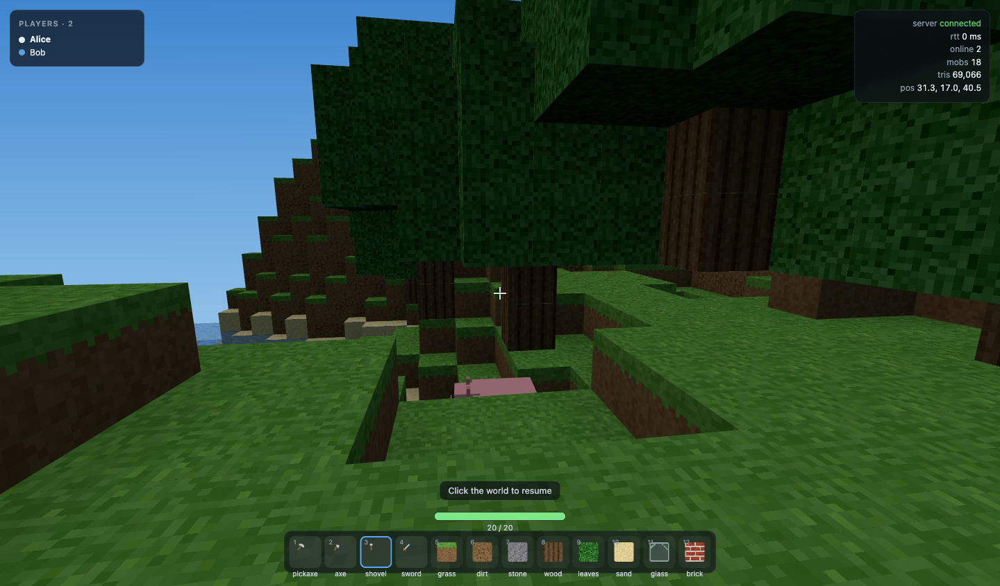

# Voxel Sandbox

浏览器多人体素沙盒:**Node 权威服务端 + three.js 客户端**。一个小世界、最多 8 人、内存权威 + 周期落盘。
服务端只有一个运行时依赖(`ws`),协议是手写的 JSON over WebSocket。

装备(镐/斧/锹/剑)、会跑的动物(猪/山羊/鸡)、以及能互相砍杀的 PvP 都在里面。




---

## 提示词

这个项目是从下面这段提示词开始做的,原样保留以便复现:

> Build a browser-based multiplayer voxel sandbox for [PLAYER COUNT] local or remote players.
> Implement a small generated world, first-person movement, block placement/removal, player names,
> synchronized transforms, and authoritative conflict handling for block edits.
> Use [NETWORK STACK] and keep the server setup minimal.
> Provide one command for the server and one for the client. Open two clients, verify join/leave
> behavior and state synchronization, and document known limits around persistence, latency, and cheating.

两个占位符的取舍:

| 占位符 | 最终选择 | 理由 |
| --- | --- | --- |
| `[PLAYER COUNT]` | **8 人** | 够开两个客户端做真实验证;再多就需要分块视野和更严格的兴趣管理 |
| `[NETWORK STACK]` | **原生 `ws` + 手写 JSON 协议** | 服务端只留 1 个运行时依赖,权威校验 / 快照广播 / 冲突仲裁全部自己写,协议时序能讲清楚 |

第一版交付后追加的需求:工具与剑(可攻击)、猪/山羊/鸡、PvP 与死亡重生、第一人称手持模型。

---

## 两条命令

```bash
npm install

npm run server     # 权威服务端，默认 ws://0.0.0.0:8787
npm run client     # 客户端（vite），打开 http://localhost:5173
```

辅助命令:

| 命令 | 作用 |
| --- | --- |
| `npm run dev` | 用 `concurrently` 同时起上面两个 |
| `npm test` | 83 个测试：worldgen 确定性 / 协议校验 / 网格化几何 / 战斗与动物 / 多客户端集成 |
| `npm run build` | 打包客户端到 `dist/`（151 KB gzip） |

**开两个客户端**验证:把上面的 `npm run client` 打开两个标签页(或两个窗口),各填一个名字即可。
想一次点开两个,直接用带参数的地址:

```
http://localhost:5173/?name=Alice&server=ws://localhost:8787
http://localhost:5173/?name=Bob&server=ws://localhost:8787
```

`?name=` 预填名字;加 `&autoplay=1` 可跳过点 Join 直接进场。`?server=` 用来指向别的服务端
(联机时把它换成主机的局域网 IP,如 `ws://192.168.1.20:8787`)。

### 服务端环境变量

| 变量 | 默认 | 说明 |
| --- | --- | --- |
| `PORT` | `8787` | 监听端口 |
| `HOST` | `0.0.0.0` | 监听地址(默认接受局域网连接) |
| `SEED` | `1337` | 世界种子,客户端靠它复现同一片地形 |
| `GAME_DATA_DIR` | `server/data` | 存档目录 |
| `SAVE_INTERVAL_MS` | `10000` | 自动存档间隔 |
| `INTEREST_RADIUS` | `48` | 快照里能看到多远的其他玩家 |

---

## 操作

| 按键 | 作用 |
| --- | --- |
| `W` `A` `S` `D` | 移动 |
| `Space` | 跳跃 / 游泳上浮 |
| `Shift` | 疾跑 |
| 左键 | 准星对着人或动物就是攻击,否则是破坏方块 |
| 右键 | 放置方块 |
| `1`–`12` / 滚轮 | 切换工具或方块 |
| `Esc` | 释放鼠标 |

准星指向的方块有黑色描边;触及距离 6 格。

---

## 装备、动物与战斗

### 工具(热键栏 1–4)

破坏仍然是**瞬时**的(点一下就挖掉一格),工具的差别体现在**同类方块的挖掘间隔**和**触及距离**上。

| 槽位 | 工具 | 伤害 | 触及 | 擅长 | 挖石头间隔 |
| --- | --- | --- | --- | --- | --- |
| 1 | 镐 pickaxe | 2 | 4.0 | 石头 / 砖 / 玻璃 | 0.20s |
| 2 | 斧 axe | 3 | 4.0 | 原木 / 树叶 | 0.30s |
| 3 | 锹 shovel | 1 | 4.0 | 土 / 草 / 沙 | 0.10s |
| 4 | 剑 sword | 5 | 3.2 | 全部(但挖得慢,0.45x) | 1.33s |
| — | 徒手 | 1 | 3.0 | — | 0.60s |

服务端会用**同一个冷却计时器**校验:间隔取自你要挖的那一格,交替两类方块也拿不到双倍速率。
这属于手感节流而不是防作弊 —— 挖快本来也没什么好处。

### 动物

猪 7 只、山羊 5 只、鸡 6 只,共 18 只常驻。**AI 完全跑在服务端 tick 里**,和其他玩家一样进 snapshot,
所以两个客户端看到的永远是同一只猪在同一个位置。

- 游荡:随机朝向走一段、停一段;遇到超过 3 格的落差会掉头,不会自己跳崖
- 受惊:被打中后朝攻击者的反方向逃跑 1.6–3 秒(山羊跑得最快)
- 碰撞:和玩家**共用同一份** `shared/collision.js`,所以动物不可能穿墙,也不会卡进方块里
- 血量:猪 10 / 山羊 8 / 鸡 6;死亡后按物种在 6–20 秒后随机重生,数量自动补回
- 客户端只负责表现:腿的摆动幅度由**实际位移**推导,所以不需要在网络上同步动画

### 战斗

- 玩家 20 血,脱战 6 秒后每 3 秒回 1 血
- 剑 5 伤害 → 4 剑必死;攻击有 0.4–0.5 秒冷却,服务端校验**冷却 / 距离 / 目标是否还活着**
- 命中会有击退:玩家的位置由服务端直接推开并下发纠正(不会和速度钳制打架),动物走自己的速度
- 死亡后 3 秒在出生点满血复活
- **PvP 是开着的** —— 和方块一样,任何人都能打任何人,没有友军/保护机制

---

## 结构

```
shared/          两端共用的纯 JS(无 three、无 node 依赖)
  constants.js     世界尺寸、频率、限速阈值、颜色表
  blocks.js        方块表(id / 各面贴图 / 是否遮挡 / 是否可放置)
  voxel.js         体素索引换算 (x,y,z) <-> idx
  worldgen.js      种子化地形:PRNG + value noise fBm + 树 + 出生盆地
  collision.js     体素 AABB 扫掠碰撞(**客户端与服务端共用同一份**)
  items.js         工具表、挖掘间隔表、热键栏布局
  mobs.js          动物物种表(血量/速度/体型/颜色)
  protocol.js      消息常量、编解码、入参校验
server/
  index.js         HTTP 健康检查 + WS 升级 + 消息路由 + tick + 优雅退出
  world.js         权威世界:blocks、applyEdit(CAS)、edits 叠加层
  players.js       名册、名字清洗、限速、移动钳制、兴趣裁剪、断线续传记录、生命/死亡/重生
  mobs.js          动物 AI:游荡、避坑、受惊逃跑、受击、重生
  persistence.js   周期 JSON 快照(临时文件 + rename 原子替换)
src/
  main.js          组装与主循环
  net/             WebSocket 客户端(退避重连/心跳)、reconciler
  world/           ClientWorld、程序化图集、面剔除+AO 网格化、渲染器
  player/          指针锁定 + DDA 拾取、远端玩家插值与受击闪红、动物模型与走路动画
  ui/              HUD(名册/状态/热键栏/提示)
test/
  harness.js       随机端口起真服务端 + 裸 ws 客户端
  unit.test.js     worldgen / 索引 / 协议 / CAS 语义
  mesher.test.js   网格几何:面位置、绕序、UV、剔除
  combat.test.js   碰撞 / 工具表 / 攻击校验 / 生命与重生 / 动物 AI 边界
  integration.test.js  join/leave/编辑/冲突/限速/钳制/续传/持久化/战斗
```

---

## 核心设计

### 世界不下发,只下发种子

服务端不把 196,608 个体素发给客户端,而是发一个 `seed`。两端跑**同一份** `shared/worldgen.js`
生成完全一致的地形,网络上只传「改动叠加层」。加入一个玩家的传输量是几百字节,与世界大小无关。
确定性由单元测试保证(同 seed 两次生成逐字节相同)。

代价:worldgen 必须是纯函数(只用 `(seed, x, z)` 哈希或固定顺序的 PRNG),且两端永远同版本。

### 方块编辑:乐观并发(compare-and-swap)

客户端 DDA 射线选中格子,提交**它所看到的旧值**:

```json
{ "type": "blockEdit", "seq": 42, "x": 31, "y": 17, "z": 30, "block": 3, "expected": 0 }
```

服务端 `world.applyEdit` 的顺序不可交换:

1. 越界检查 → `error{out_of_bounds}`
2. 方块合法性(不可放置/破坏基岩)→ `error{bad_block}`
3. 速率限制(≥60ms 间隔、≤5 次/秒)→ `error{rate_limited}`
4. **CAS**:`actual !== expected` → 回 `editRejected{actual}`,**世界不动**
5. 通过:写入、记入叠加层、广播 `blockChanged`

客户端先本地乐观应用并记 pending;之后无论收到自己那笔的 `blockChanged` 回声,还是输掉竞态后的
`editRejected`,都会把该格覆盖为服务端真值。**同一格并发编辑 → 恰好一人成功,另一人当帧被纠正,两端必然收敛。**

Node 是单线程且 `applyEdit` 中间没有 `await`,所以「读-比对-写」天然原子,不需要锁。

> 协议里方块 id 字段叫 `block` 而不是 `type` —— 后者会和消息信封的类型字段冲突。
> `encode()` 也把 `type` 写在展开之后兜底。

### 同步节奏

| 方向 | 频率 | 内容 |
| --- | --- | --- |
| 客户端 → 服务端 | 20 Hz | `input`(位置 + 朝向 + 客户端估计的服务端时间) |
| 服务端 → 客户端 | 15 Hz | `snapshot`,**只含兴趣半径内的玩家** |
| 事件驱动 | — | `playerJoin` / `playerLeave` / `blockChanged` / `editRejected` / `correction` |

snapshot 只带 `{id, x, y, z, yaw, pitch}`(名字来自 `init`/`playerJoin`),远端客户端按
`serverTime - 100ms` 做插值渲染;缓冲欠载时最多外推 200ms。

### 断线重连与身份续传

客户端 `sessionStorage` 存一个 `resumeToken`,重连时带回。服务端把断开的玩家身份在内存里保留 60 秒
(`RESUME_TTL_MS`),期间重连可拿回**同一个 id / 名字 / 颜色 / 位置**,其他人则照常立刻看到 `playerLeave`
(不会留下幽灵化身)。超时后记录被清理,再连就是新玩家。

### 消息协议

上行 `hello` / `input` / `blockEdit` / `ping`;下行 `init` / `playerJoin` / `playerLeave` /
`snapshot` / `blockChanged` / `editRejected` / `correction` / `pong` / `error`。
定义与校验都在 `shared/protocol.js`,两端共用,不会手抄漂移。

---

## 已知限制

### 持久化

- **10 秒存档窗口**:崩溃/断电会丢失最后一次存档之后的改动。`SIGINT`/`SIGTERM` 会立即落盘。
- **单进程单文件**:没有共享状态,不能横向扩容,也没有迁移/版本升级路径(存档格式带 `version`,不匹配即重建)。
- **无账号、无权限**:任何人都能改世界任何一格,没有建造者归属、没有撤销、没有回滚。
- **存档损坏即清空**:`world.json` 解析失败时记一条日志并从种子重建,已存改动全部丢失(不阻塞启动)。
- 存的是**改动叠加层**而不是全量体素,所以同一格反复改动不会让存档膨胀。

### 延迟

- 上行 20Hz / 下行 15Hz 决定了操作手感上限,没有更细的 tick。
- 远端玩家走 100ms 插值缓冲,**没有服务端延迟补偿**:你准星瞄准的方块可能刚被他人拿走 ——
  仲裁仍然正确(CAS 会拒你),只是手感受影响。
- 没有抖动缓冲的自适应调参,外推上限固定 200ms。
- 本机实测 RTT 0–1ms;局域网同量级;跨网 50–150ms 时远端玩家会明显更「糊」。

### 作弊

- **移动是客户端权威 + 服务端限速钳制**:服务端**不重演物理**,只检查相邻两次 `input` 的位移是否可能
  (`速度上限 × 1.5 × dt + 0.3`)。改过的客户端可以在这个窗口内做轻微加速,10 秒内累计 5 次被踢。
  严格防作弊需要服务端物理重演或延迟补偿,那是另一个量级的工程。
- **方块编辑完全权威**:越界、非法方块、破坏基岩、超速都被服务端拒绝,客户端无法凭空造块。
  但**没有权限系统**,所以可以蓄意破坏别人的世界。
- **无鉴权**:任何人都能加入、能冒用任何名字(重名会自动加后缀)。`resumeToken` 只保存在自己的
  `sessionStorage`,别人拿不到就冒充不了你的身份。
- DoS 防护只有最基础的一层:单帧 16KB(`maxPayload`)、编辑/上行限速、8 人上限。够挡住手滑和脚本小子,
  挡不住有心的攻击者。
- 客户端持有完整世界数据,所以不存在「隐藏方块」这种反作弊手段可依赖。

### 战斗与动物

- **PvP 完全开放**:任何人都能砍任何人,没有队伍、友军、保护区或建造者归属。
- **攻击判定很粗**:只校验"服务端记录的你最后位置"到目标的距离,没有做视线遮挡、背后惩罚或延迟补偿,
  所以隔着一堵墙打不到人(距离够了就行)、但对着墙后的人砍下去服务端会认为你没打中。
  **没有服务端重演攻击**,移动中的目标是否被击中完全取决于你上报位置的时刻。
- **武器只有一把剑**:没有弓、投掷物、护甲或格挡,伤害是固定值,没有暴击/部位。
- **动物是状态机不是生物**:只有游荡、避坑、受惊逃跑三种状态,没有饥饿、繁殖、群体行为、
  不区分昼夜、没有掉落物。被打死就是消失 + 计时重生。
- **动物不会攻击**:它们是被打的靶子,不会主动反击玩家,也不会互相攻击。
- **装备没有耐久、没有掉落、没有合成、没有背包**:工具是无限耐用的,动物不掉东西,
  也就没有成长曲线 —— 这一层的深度是明确留给后续的。
- 击退是**瞬时位移**而不是物理冲量,看起来会比较"生硬"。

### 渲染与世界

- **没有 greedy meshing**:只做面剔除 + 逐顶点 AO。这个规模(约 69k 三角面)对 GPU 毫无压力,
  greedy 只会增加实现风险;真要扩世界再上。
- **没有阴影、没有动态光照**:靠烘焙 AO + 面向明暗(顶 1.0 / 侧 0.8 / 底 0.6)。
- 世界 64×48×64 全量常驻内存,没有区块流式加载,扩世界需要重新设计分块和增量下发。
- 贴图是运行时用 Canvas 程序化画的 4×4 图集(无外部素材),像素风,不追求写实。
- 远端玩家是彩色方块 + 名牌,没有骨骼动画、皮肤或聊天。

---

## 验证过的东西

`npm test` 覆盖 83 项,其中集成测试是真起服务端、真发 WebSocket:

- worldgen 同 seed 逐字节一致 / 不同 seed 不同 / 出生点脚下有地
- 协议拒绝缺字段、类型错、未知类型、非 JSON
- 网格化:每个面必须落在自己方块的边界平面上、绕序外向、UV 恰好跨一个 tile 且草地侧面纹理不倒置、
  相邻不透明方块剔除共享面、玻璃不遮挡邻居、真实世界无 NaN / 无越界索引
- 权威世界:CAS 只认匹配方、冲突不改世界、叠加层不随重复编辑膨胀、基岩不可破坏
- join:init 契约、互相 playerJoin、重名消歧、空名拒绝、满员拒绝
- sync:移动经 snapshot 传播、兴趣半径外互相不可见
- leave:断开广播 playerLeave,后续 snapshot 不再包含该玩家
- 编辑:应用 + 广播 + 回声;**同格竞态恰好一个赢家,输家收到带真值的 editRejected**
- 限速 / 越界 / 非法方块 / 3 次畸形帧断连 / 瞬移被纠正回正
- 战斗:剑在触及范围内造成伤害并广播、攻击冷却被拒、超距被拒、杀死动物后广播移除、
  玩家互相砍杀 4 剑致死、死亡后 3 秒在出生点满血复活、死亡状态不能挥击
- 工具:挖掘间隔由服务端节流,冷却内的破坏被丢弃而不是排队
- 动物:出生时有地面且互不重叠、模拟一分钟后没有一只穿墙或掉出世界、快照里坐标始终在世界范围内、
  受击会逃跑、死亡后数量自动补回
- 续传:带 token 重连拿回同一 id 与全部改动;无 token 是新玩家
- 持久化:重启后改动仍在、损坏存档回落重建、定时器不靠显式关闭也能存

浏览器实跑(两个标签页)额外确认:移动同步(RTT 0–1ms,坐标一致到小数点后 5 位)、方块编辑双端一致、
真实同格竞态两端收敛到同一值、关闭标签后名册与化身消失、服务端重启后客户端自动重连且改动仍在、
60 FPS / 69k 三角面 / 首次建图 ~30ms;以及 PvP 血量逐击递减 20→15→10→5→0、死亡遮罩、
重生回满血、动物模型与走路动画、12 格热键栏(工具图标 + 方块缩略图)、HUD 血条。
